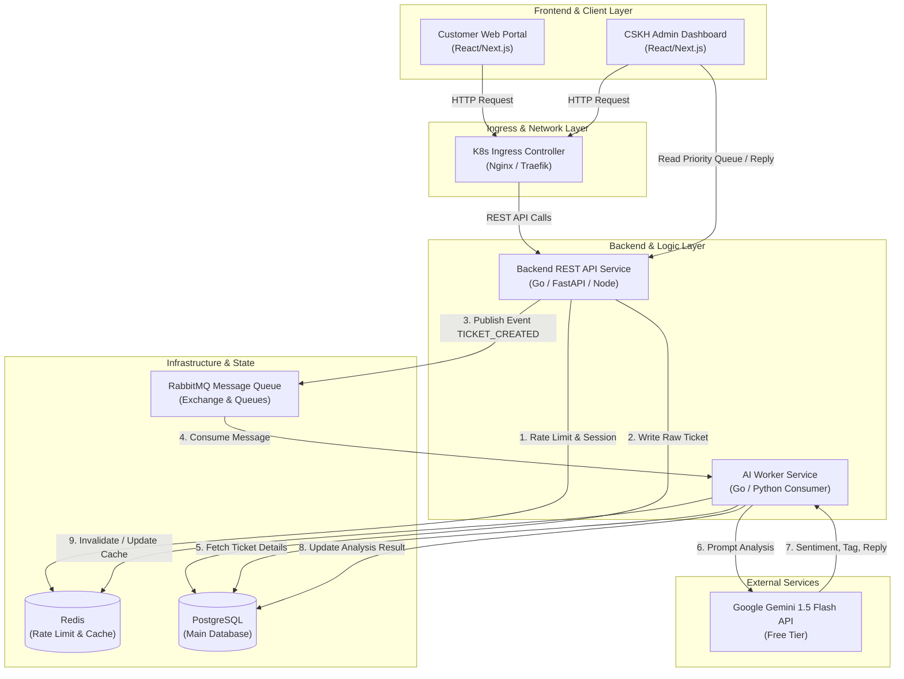
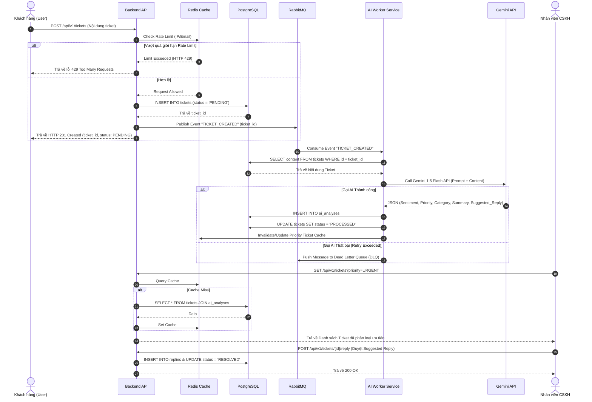

# SYSTEM ARCHITECTURE SPECIFICATION

**Dự án:** AI-Powered Smart Ticketing & CSKH System  
**Phiên bản:** 1.0  
**Trạng thái:** Draft / Architecture Baseline

---

## 1. Bức tranh Tổng quan Kiến trúc (High-Level Architecture)

Hệ thống được thiết kế theo kiến trúc **Microservices** kết hợp **Event-Driven Architecture (EDA)** nhằm đảm bảo khả năng mở rộng độc lập, tính khả dụng cao và độ trễ phản hồi phía Client nhỏ hơn $100\text{ms}$.



---

## 2. Chi tiết 11 Thành phần Công nghệ (11-Pillar Tech Integration)

### 2.1. Backend API Service

**Vai trò:** Tiếp nhận HTTP Request từ Client, thực hiện kiểm tra tính hợp lệ (Validation), Authentication, Rate Limiting và thao tác với Database.

**Đặc tính:** Stateless service để phục vụ cho việc auto-scale ngang trong Kubernetes.

**Nguyên lý Async:** Khi nhận request tạo Ticket, Backend ghi nhận vào Database với trạng thái PENDING, phát tín hiệu sang RabbitMQ và lập tức phản hồi $201\text{ Created}$ cho Client mà không chờ xử lý AI.

### 2.2. Database (PostgreSQL)

**Vai trò:** Hệ quản trị cơ sở dữ liệu quan hệ (RDBMS) chính.

**Lưu trữ:** Thông tin người dùng (users), thông tin ticket (tickets), kết quả phân tích AI (ai_analyses), phản hồi CSKH (replies), và dữ liệu FAQ (faqs).

**Tối ưu hóa:** Sử dụng B-Tree Index cho các cột hay truy vấn/sắp xếp: status, created_at, priority, user_id.

### 2.3. Redis Caching & Rate Limiter

**Vai trò:** Bộ nhớ tạm In-Memory cho mục đích tăng tốc truy xuất và bảo vệ hệ thống.

**Chức năng chính:**
- **Rate Limiting:** Sử dụng thuật toán Fixed Window / Leaky Bucket chống spam API (`rate_limit:user:{id}`)
- **Cache Priority List:** Cache danh sách ticket khẩn cấp dành cho CSKH Dashboard để giảm tải query phức tạp (JOIN/ORDER BY) vào PostgreSQL
- **FAQ Caching:** Cache dữ liệu các câu hỏi thường gặp

### 2.4. Message Queue (RabbitMQ)

**Vai trò:** Xương sống của kiến trúc Event-Driven, giúp decoupled (tách rời) luồng API và luồng AI ngầm.

**Cấu trúc Exchange & Queue:**
- **Exchange:** `ticket.direct.exchange` (Direct Exchange)
- **Routing Key:** `ticket.created.key`
- **Main Queue:** `ticket.process.queue` (Xử lý các ticket mới)
- **Dead Letter Queue (DLQ):** `ticket.dlq` (Chứa các message bị lỗi quá 3 lần retry để xử lý thủ công)

### 2.5. AI Integration (Gemini 1.5 Flash API)

**Vai trò:** "Bộ brain" tự động xử lý nội dung văn bản.

**Nhiệm vụ:**
- **Sentiment Analysis:** Nhận diện cảm xúc khách hàng (POSITIVE, NEUTRAL, ANGRY)
- **Priority Classification:** Đánh giá mức độ khẩn cấp (LOW, MEDIUM, HIGH, URGENT)
- **Categorization:** Gán nhãn chủ đề (REFUND, TECHNICAL_BUG, SHIPPING, FAQ)
- **Summarization:** Tóm tắt ticket thành 1 câu ngắn gọn
- **Auto-Draft Reply:** Sinh câu trả lời điều CSKH chuyên nghiệp

### 2.6. AI Worker Service

**Vai trò:** Consumer chạy ngầm ngắt tin nhắn từ RabbitMQ và điều phối lời AI API.

**Cơ chế xử lý lỗi (Resilience):**
- **Exponential Backoff Retry:** Tự động gọi lại Gemini API khi gặp lỗi giãn đoạn mạng hoặc HTTP 429 (Rate Limit)
- **Circuit Breaker:** Ngắt kết nối tạm thời để chờ Gemini API khôi phục

### 2.7. Docker Containerization

**Vai trò:** Chuẩn hóa môi trường chạy ứng dụng trên tất cả các máy tính (máy dev, staging, production).

**Container Images:**
- Backend API Service Dockerfile
- AI Worker Service Dockerfile
- Frontend Portal Dockerfile

### 2.8. Linux (OS Environment)

**Vai trò:** Nền tảng hệ điều hành cho tất cả container và orchestration.

**Cấu hình:** WSL2 Ubuntu (local) hoặc Oracle Cloud Linux VM (production).

### 2.9. Oracle Cloud (Cloud Infrastructure)

**Vai trò:** Lưu trữ toàn bộ cơ sở hạ tầng hosting đảm bảo chi phí 0đ.

**Thông số:** 1 Instance Ampere ARM 4 vCPU, 24GB RAM, 200GB NVMe Storage (Always Free Tier).

### 2.10. CI/CD Pipeline (GitHub Actions)

**Vai trò:** Tự động hóa quy trình Kiểm thử (Testing), đóng gói (Build) và Triển khai (Deploy).

**Luồng CI/CD:**
```
Git Push (main branch)
├──> 1. Run Unit Tests & Linter
├──> 2. Build Docker Images (Backend & Worker)
├──> 3. Push Images to Docker Hub (Tagged with commit SHA)
└──> 4. SSH to K8s Server & Execute `kubectl apply`
```

### 2.11. Kubernetes (K3s / k3d) Orchestration

**Vai trò:** Điều phối, quản lý chu kỳ sống của các Containers (Pods), Auto-scaling và Service Discovery.

**Thành phần Deployment:**
- **Deployments:** backend-api, ai-worker, postgres, redis, rabbitmq
- **Services:** ClusterIP cho kết nối nội bộ; NodePort/Ingress cho lưu lượng bên ngoài
- **ConfigMaps & Secrets:** Quản lý môi trường và chìa khóa bảo mật (Gemini API Key, DB Passwords)
- **HPA / KEDA:** Tự động tăng số lượng Pod ai-worker từ 1 lên 5 khi số lượng tin nhắn dồn ứ trong RabbitMQ Queue vượt ngưỡng $> 50$

---

## 3. Luồng Dữ liệu Chi tiết (Event-Driven Sequence Flow)

Sơ đồ trình bày chi tiết hành trình của một Ticket từ khi khởi tạo đến khi được AI phân tích và phản hồi cho CSKH:



---

## 4. Lựa chọn Mẫu Thiết kế Hệ thống (System Design Patterns)

- **Publisher-Subscriber Pattern:** Áp dụng với RabbitMQ giúp tách biệt sự phụ thuộc trực tiếp giữa Backend API và AI Processing

- **Asynchronous Request-Reply:** Khách hàng nhận phản hồi ngay lập tức sau khi tạo ticket; kết quả phân tích AI được cập nhật bất đồng bộ

- **Cache-Aside Pattern:** Hệ thống kiểm tra dữ liệu trên Redis trước khi truy vấn PostgreSQL. Nếu không có (Cache Miss), đọc từ DB và ghi đè lại vào Redis

- **Retry with Exponential Backoff:** Khi gọi dịch vụ bên ngoài (Gemini API), hệ thống sẽ thử lại sau $2^1, 2^2, 2^3\dots$ giây trước khi báo lỗi hẳn

- **Circuit Breaker:** Tự động "ngắt cầu chì" không gửi thêm request sang Gemini API nếu phát hiện tỷ lệ lỗi của Gemini API vượt quá $50\%$ trong 1 phút

---

## 5. Quy hoạch Thư mục Mã nguồn (Repository Structure)

```
smart-ticketing-system/
├── .github/
│   └── workflows/
│       └── ci-cd.yml             # GitHub Actions Pipeline
├── docs/                         # Tài liệu hệ thống
│   ├── REQUIREMENTS.md
│   ├── ARCHITECTURE.md
│   ├── DATABASE_DESIGN.md
│   ├── API_SPECIFICATION.md
│   └── DEPLOYMENT_PLAN.md
├── k8s/                          # Kubernetes Manifests
│   ├── configmap.yaml
│   ├── secrets.yaml
│   ├── backend-deployment.yaml
│   ├── worker-deployment.yaml
│   ├── postgres-deployment.yaml
│   ├── redis-deployment.yaml
│   ├── rabbitmq-deployment.yaml
│   └── ingress.yaml
├── src/
│   ├── backend/                  # Backend API Service
│   │   ├── Dockerfile
│   │   ├── main.go / app.py
│   │   └── ...
│   ├── worker/                   # AI Worker Service
│   │   ├── Dockerfile
│   │   ├── worker.py / worker.go
│   │   └── ...
│   └── frontend/                 # Client & CSKH Portal (Next.js/React)
│       ├── Dockerfile
│       └── ...
├── docker-compose.yml            # Local Infrastructure Setup
└── README.md
```

---

**Kết luận:** Kiến trúc này đảm bảo tính scalable, maintainable, cost-efficient, và sẵn sàng cho các cuộc tấn công bất ngờ (Flash Sale, Spike Traffic) thông qua Event-Driven Architecture và Auto-Scaling trên Kubernetes.
