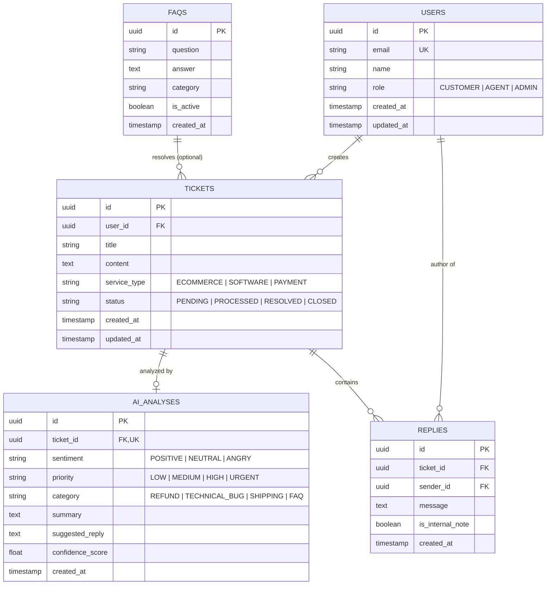

# DATABASE DESIGN SPECIFICATION

* **Dự án:** AI-Powered Smart Ticketing & CSKH System
* **Phiên bản:** 1.0
* **Trạng thái:** Draft / Architecture Baseline

---

## 1. Tổng quan Kiến trúc Dữ liệu (Data Architecture Overview)

Hệ thống sử dụng mô hình lưu trữ kết hợp **Polyglot Persistence**:
* **PostgreSQL (Relational Primary Database):** Đảm bảo tính toàn vẹn dữ liệu (ACID), lưu trữ lâu dài mối quan hệ giữa Người dùng, Ticket, Kết quả phân tích AI và Lịch sử phản hồi.
* **Redis (In-Memory Key-Value Data Store):** Đóng vai trò lớp đệm Caching giảm tải DB, lưu Session, và thực thi Rate Limiting với tốc độ phản hồi $t < 2\text{ms}$.

---

## 2. Sơ đồ Quan hệ Thực thể (Entity Relationship Diagram - ERD)



---

## 3. Chi tiết Bảng dữ liệu PostgreSQL (Database Schema)

### 3.1. Bảng `users` (Người dùng & Nhân viên CSKH)
Lưu giữ thông tin tài khoản bao gồm cả khách hàng và nhân viên hỗ trợ.

| Tên cột | Kiểu dữ liệu | Constraint | Mô tả |
| :--- | :--- | :--- | :--- |
| **id** | UUID | PRIMARY KEY, Default `gen_random_uuid()` | Định danh duy nhất |
| **email** | VARCHAR(255) | UNIQUE, NOT NULL | Email đăng nhập/liên hệ |
| **name** | VARCHAR(100) | NOT NULL | Họ và tên |
| **role** | VARCHAR(20) | NOT NULL, Default `'CUSTOMER'` | Vai trò: `CUSTOMER`, `AGENT`, `ADMIN` |
| **created_at** | TIMESTAMPTZ | NOT NULL, Default `NOW()` | Thời gian khởi tạo |
| **updated_at** | TIMESTAMPTZ | NOT NULL, Default `NOW()` | Thời gian cập nhật gần nhất |

### 3.2. Bảng `tickets` (Yêu cầu hỗ trợ)
Lưu trữ thông tin ticket thô do khách hàng gửi về.

| Tên cột | Kiểu dữ liệu | Constraint | Mô tả |
| :--- | :--- | :--- | :--- |
| **id** | UUID | PRIMARY KEY, Default `gen_random_uuid()` | Định danh Ticket |
| **user_id** | UUID | FOREIGN KEY $\rightarrow$ `users(id)`, NOT NULL | Người tạo ticket |
| **title** | VARCHAR(255) | NOT NULL | Tiêu đề ticket |
| **content** | TEXT | NOT NULL | Nội dung chi tiết |
| **service_type** | VARCHAR(50) | NOT NULL, Default `'GENERAL'` | Dịch vụ: `ECOMMERCE`, `SOFTWARE`, `PAYMENT` |
| **status** | VARCHAR(20) | NOT NULL, Default `'PENDING'` | Trạng thái: `PENDING`, `PROCESSED`, `RESOLVED`, `CLOSED` |
| **created_at** | TIMESTAMPTZ | NOT NULL, Default `NOW()` | Thời điểm tạo ticket |
| **updated_at** | TIMESTAMPTZ | NOT NULL, Default `NOW()` | Thời điểm cập nhật |

### 3.3. Bảng `ai_analyses` (Kết quả Phân tích AI)
Lưu trữ thông tin do AI Worker phân tích ngầm từ Gemini API. Quan hệ $1-1$ với bảng `tickets`.

| Tên cột | Kiểu dữ liệu | Constraint | Mô tả |
| :--- | :--- | :--- | :--- |
| **id** | UUID | PRIMARY KEY, Default `gen_random_uuid()` | Định danh kết quả |
| **ticket_id** | UUID | FOREIGN KEY $\rightarrow$ `tickets(id)`, UNIQUE, NOT NULL | Ticket liên quan |
| **sentiment** | VARCHAR(20) | NOT NULL | Cảm xúc: `POSITIVE`, `NEUTRAL`, `ANGRY` |
| **priority** | VARCHAR(20) | NOT NULL | Ưu tiên: `LOW`, `MEDIUM`, `HIGH`, `URGENT` |
| **category** | VARCHAR(50) | NOT NULL | Phân loại: `REFUND`, `TECHNICAL_BUG`, `SHIPPING`, `FAQ` |
| **summary** | TEXT | NOT NULL | Tóm tắt ticket 1-2 câu |
| **suggested_reply** | TEXT | NOT NULL | Câu trả lời gợi ý do Gemini sinh |
| **confidence_score** | NUMERIC(3,2) | Default `0.00` | Độ tin cậy của AI ($0.00 \rightarrow 1.00$) |
| **created_at** | TIMESTAMPTZ | NOT NULL, Default `NOW()` | Thời gian AI hoàn tất xử lý |

### 3.4. Bảng `replies` (Lịch sử trao đổi / Phản hồi)
Lưu các tin nhắn qua lại giữa Khách hàng và CSKH.

| Tên cột | Kiểu dữ liệu | Constraint | Mô tả |
| :--- | :--- | :--- | :--- |
| **id** | UUID | PRIMARY KEY, Default `gen_random_uuid()` | Định danh câu trả lời |
| **ticket_id** | UUID | FOREIGN KEY $\rightarrow$ `tickets(id)`, NOT NULL | Trỏ tới ticket gốc |
| **sender_id** | UUID | FOREIGN KEY $\rightarrow$ `users(id)`, NOT NULL | Người gửi tin nhắn |
| **message** | TEXT | NOT NULL | Nội dung tin nhắn |
| **is_internal_note** | BOOLEAN | Default `FALSE` | Đánh dấu ghi chú nội bộ CSKH |
| **created_at** | TIMESTAMPTZ | NOT NULL, Default `NOW()` | Thời điểm gửi |

### 3.5. Bảng `faqs` (Câu hỏi thường gặp)
Thư viện tri thức (Knowledge Base) để AI hoặc CSKH tham chiếu.

| Tên cột | Kiểu dữ liệu | Constraint | Mô tả |
| :--- | :--- | :--- | :--- |
| **id** | UUID | PRIMARY KEY, Default `gen_random_uuid()` | Định danh FAQ |
| **question** | TEXT | NOT NULL | Câu hỏi thường gặp |
| **answer** | TEXT | NOT NULL | Câu trả lời chuẩn |
| **category** | VARCHAR(50) | NOT NULL | Chuyên mục |
| **is_active** | BOOLEAN | Default `TRUE` | Trạng thái kích hoạt |
| **created_at** | TIMESTAMPTZ | NOT NULL, Default `NOW()` | Thời gian tạo |

---

## 4. Script khởi tạo SQL DDL (PostgreSQL Script)

```sql
-- Kích hoạt extension hỗ trợ sinh UUID
CREATE EXTENSION IF NOT EXISTS "uuid-ossp";

-- 1. Tạo Bảng USERS
CREATE TABLE IF NOT EXISTS users (
    id UUID PRIMARY KEY DEFAULT gen_random_uuid(),
    email VARCHAR(255) UNIQUE NOT NULL,
    name VARCHAR(100) NOT NULL,
    role VARCHAR(20) NOT NULL DEFAULT 'CUSTOMER' CHECK (role IN ('CUSTOMER', 'AGENT', 'ADMIN')),
    created_at TIMESTAMPTZ NOT NULL DEFAULT NOW(),
    updated_at TIMESTAMPTZ NOT NULL DEFAULT NOW()
);

-- 2. Tạo Bảng TICKETS
CREATE TABLE IF NOT EXISTS tickets (
    id UUID PRIMARY KEY DEFAULT gen_random_uuid(),
    user_id UUID NOT NULL REFERENCES users(id) ON DELETE CASCADE,
    title VARCHAR(255) NOT NULL,
    content TEXT NOT NULL,
    service_type VARCHAR(50) NOT NULL DEFAULT 'GENERAL',
    status VARCHAR(20) NOT NULL DEFAULT 'PENDING' CHECK (status IN ('PENDING', 'PROCESSED', 'RESOLVED', 'CLOSED')),
    created_at TIMESTAMPTZ NOT NULL DEFAULT NOW(),
    updated_at TIMESTAMPTZ NOT NULL DEFAULT NOW()
);

-- 3. Tạo Bảng AI_ANALYSES
CREATE TABLE IF NOT EXISTS ai_analyses (
    id UUID PRIMARY KEY DEFAULT gen_random_uuid(),
    ticket_id UUID UNIQUE NOT NULL REFERENCES tickets(id) ON DELETE CASCADE,
    sentiment VARCHAR(20) NOT NULL CHECK (sentiment IN ('POSITIVE', 'NEUTRAL', 'ANGRY')),
    priority VARCHAR(20) NOT NULL CHECK (priority IN ('LOW', 'MEDIUM', 'HIGH', 'URGENT')),
    category VARCHAR(50) NOT NULL,
    summary TEXT NOT NULL,
    suggested_reply TEXT NOT NULL,
    confidence_score NUMERIC(3,2) DEFAULT 0.00,
    created_at TIMESTAMPTZ NOT NULL DEFAULT NOW()
);

-- 4. Tạo Bảng REPLIES
CREATE TABLE IF NOT EXISTS replies (
    id UUID PRIMARY KEY DEFAULT gen_random_uuid(),
    ticket_id UUID NOT NULL REFERENCES tickets(id) ON DELETE CASCADE,
    sender_id UUID NOT NULL REFERENCES users(id) ON DELETE CASCADE,
    message TEXT NOT NULL,
    is_internal_note BOOLEAN DEFAULT FALSE,
    created_at TIMESTAMPTZ NOT NULL DEFAULT NOW()
);

-- 5. Tạo Bảng FAQS
CREATE TABLE IF NOT EXISTS faqs (
    id UUID PRIMARY KEY DEFAULT gen_random_uuid(),
    question TEXT NOT NULL,
    answer TEXT NOT NULL,
    category VARCHAR(50) NOT NULL,
    is_active BOOLEAN DEFAULT TRUE,
    created_at TIMESTAMPTZ NOT NULL DEFAULT NOW()
);

-- CHIẾN LƯỢC ĐÁNH INDEX (INDEXING STRATEGY)
-- Tối ưu truy vấn danh sách ticket theo User
CREATE INDEX IF NOT EXISTS idx_tickets_user_id ON tickets(user_id);

-- Tối ưu truy vấn theo Status & Created_at (phục vụ lọc & phân trang)
CREATE INDEX IF NOT EXISTS idx_tickets_status_created ON tickets(status, created_at DESC);

-- Tối ưu JOIN giữa tickets và ai_analyses
CREATE INDEX IF NOT EXISTS idx_ai_analyses_ticket_id ON ai_analyses(ticket_id);

-- Tối ưu tìm kiếm ticket ưu tiên cao dành cho CSKH Dashboard
CREATE INDEX IF NOT EXISTS idx_ai_analyses_priority ON ai_analyses(priority);
```

---

## 5. Quy hoạch & Chiến lược Caching trên Redis (Redis Key Strategy)

Redis được thiết kế để chịu tải các truy vấn lặp đi lặp lại và bảo vệ Backend khỏi tấn công DOS/Spam.

### 5.1. Bảng Quy ước Key (Key Convention)

| Mục đích | Pattern Redis Key | Data Structure | TTL (Thời gian sống) | Mô tả |
| :--- | :--- | :--- | :--- | :--- |
| Rate Limiting | `rate_limit:ip:{ip_address}` | String (Counter) | 60s | Giới hạn 5 req/phút/IP |
| Rate Limiting User | `rate_limit:user:{user_id}` | String (Counter) | 60s | Giới hạn 5 tickets/phút/User |
| Priority Queue Cache | `cache:tickets:priority_list` | Sorted Set / JSON | 300s (5 phút) | Cache top ticket URGENT / ANGRY |
| Ticket Detail Cache | `cache:ticket:{ticket_id}` | Hash / JSON String | 600s (10 phút) | Cache chi tiết ticket + kết quả AI |
| FAQ List Cache | `cache:faqs:all` | String (JSON) | 3600s (1 giờ) | Cache danh sách câu hỏi FAQ |

### 5.2. Luồng thao tác Redis (Cache Strategy Mechanics)

* **Rate Limiting (Fixed Window Counter):**
  * Khi Client gọi `POST /api/v1/tickets`, Backend kiểm tra key `rate_limit:user:{user_id}`.
  * Nếu Counter $> 5$, lập tức từ chối với HTTP `429 Too Many Requests`.
  * Ngược lại, tăng counter thêm $1$ (INCR) và thiết lập EXPIRE 60 giây.

* **Cache-Aside Pattern cho Priority List:**
  * Nhân viên CSKH tải Dashboard $\rightarrow$ Backend đọc từ Key `cache:tickets:priority_list`.
  * **Cache Hit:** Trả về JSON ngay lập tức ($t < 2\text{ms}$).
  * **Cache Miss:** Query PostgreSQL (`SELECT * FROM tickets JOIN ai_analyses WHERE priority = 'URGENT'`), sau đó ghi kết quả ngược lại vào Redis với TTL $300\text{s}$.
  * **Invalidation:** Khi AI Worker cập nhật một ticket thành URGENT, Worker chủ động thực hiện lệnh `DEL cache:tickets:priority_list` để làm tươi cache.
