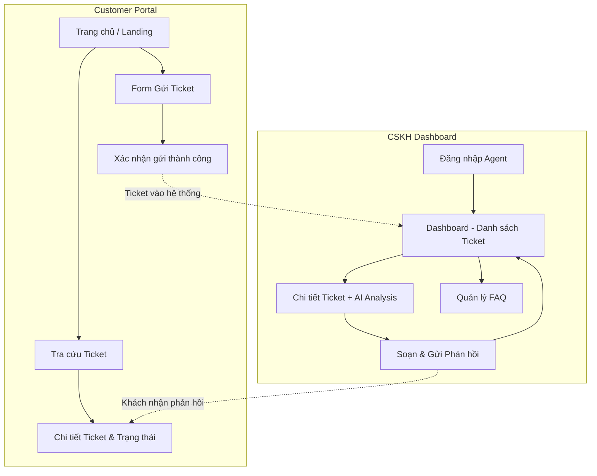
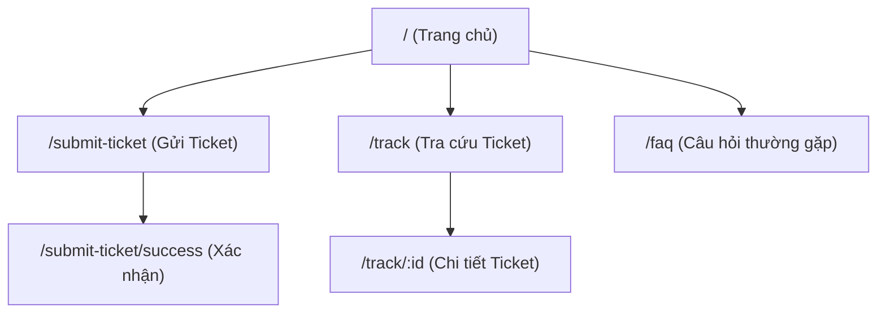
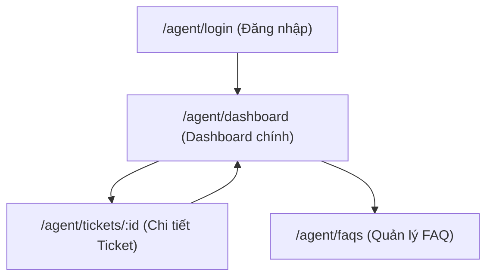
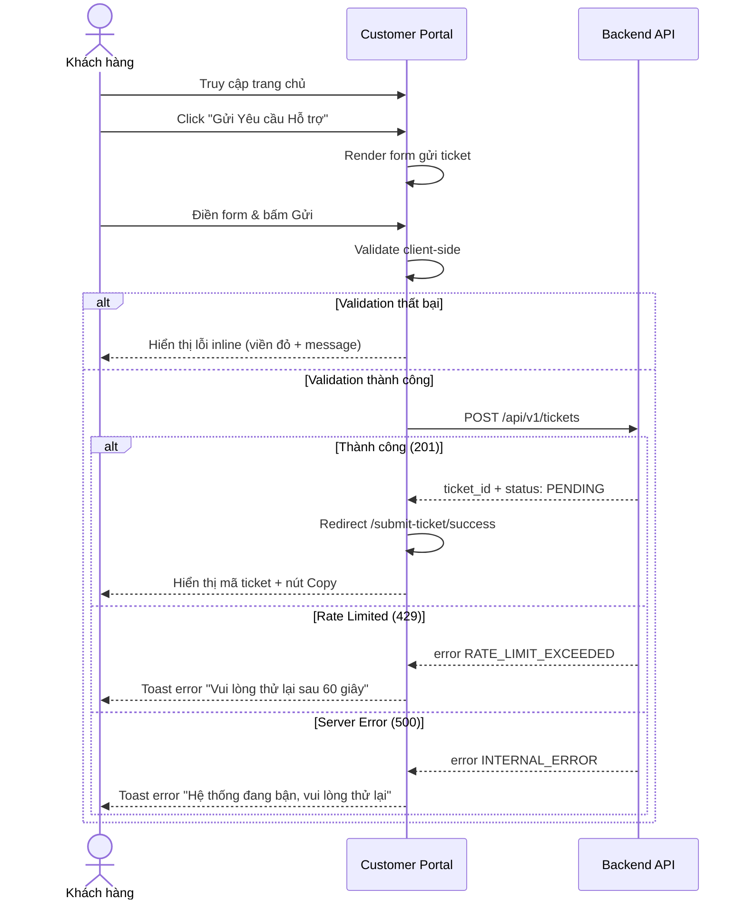
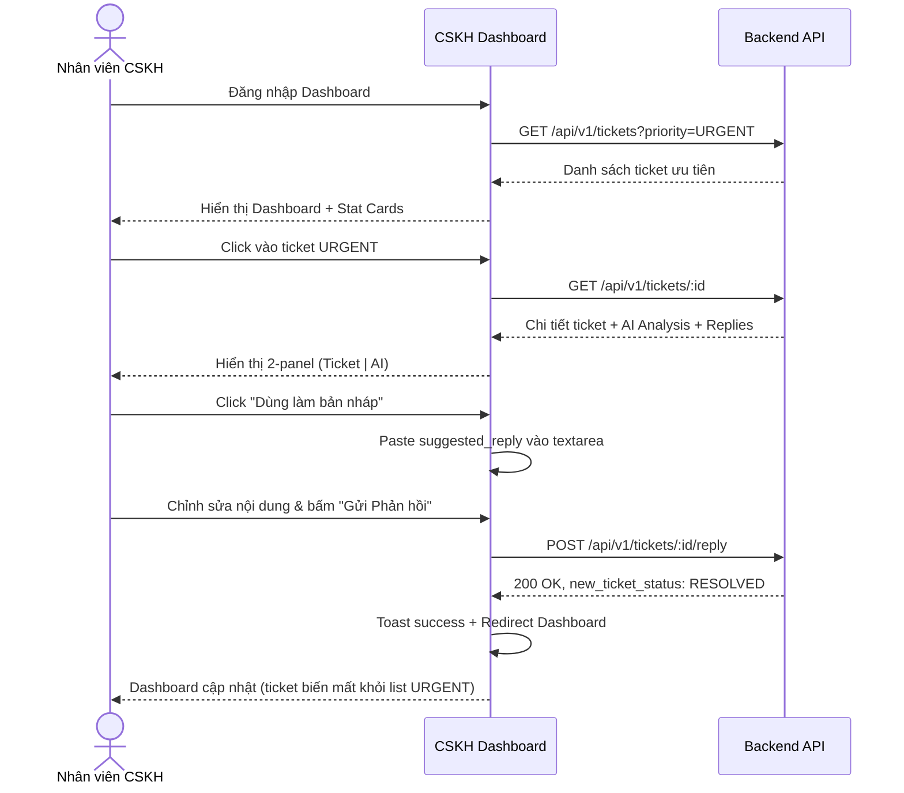

# FRONTEND DESIGN SPECIFICATION

* **Dự án:** AI-Powered Smart Ticketing & CSKH System
* **Phiên bản:** 1.0
* **Trạng thái:** Draft / UI Baseline
* **Phong cách:** Modern SaaS Minimal (Tham khảo: Linear, Vercel, Notion)
* **Framework:** React (Vite) + Tailwind CSS + shadcn/ui + Zustand

---

## 1. Tổng quan Thiết kế (Design Overview)

### 1.1. Hệ thống Giao diện (UI Systems)

Hệ thống frontend bao gồm **2 phân hệ** độc lập về layout nhưng chia sẻ chung Design System:

| Phân hệ | Đối tượng sử dụng | Mô tả |
| :--- | :--- | :--- |
| **Customer Portal** | Khách hàng | Gửi ticket hỗ trợ, tra cứu trạng thái & lịch sử ticket |
| **CSKH Dashboard** | Nhân viên CSKH / Agent | Xem danh sách ticket ưu tiên, đọc phân tích AI, phản hồi khách hàng |

### 1.2. Luồng Người dùng Tổng thể (User Flow Overview)



---

## 2. Design System (Hệ thống Thiết kế)

### 2.1. Bảng Màu (Color Palette)

Phong cách **Minimal Dark/Light** với khả năng chuyển đổi theme.

| Token | Light Mode | Dark Mode | Sử dụng |
| :--- | :--- | :--- | :--- |
| `--bg-primary` | `#FFFFFF` | `#0A0A0B` | Nền chính |
| `--bg-secondary` | `#F8F9FA` | `#141415` | Nền card, sidebar |
| `--bg-tertiary` | `#F0F1F3` | `#1E1E20` | Nền input, hover state |
| `--text-primary` | `#111111` | `#EDEDEF` | Text chính |
| `--text-secondary` | `#6B7280` | `#8B8B8E` | Text phụ, label |
| `--text-muted` | `#9CA3AF` | `#5C5C5F` | Placeholder, caption |
| `--border` | `#E5E7EB` | `#2A2A2D` | Viền card, divider |
| `--accent` | `#6366F1` | `#818CF8` | Nút CTA, link, focus ring |
| `--accent-hover` | `#4F46E5` | `#6366F1` | Hover trên accent |

**Màu ngữ nghĩa (Semantic Colors):**

| Token | Giá trị | Sử dụng |
| :--- | :--- | :--- |
| `--success` | `#22C55E` | Trạng thái RESOLVED, thành công |
| `--warning` | `#F59E0B` | Trạng thái PROCESSED, priority HIGH |
| `--danger` | `#EF4444` | Sentiment ANGRY, priority URGENT |
| `--info` | `#3B82F6` | Trạng thái PENDING, thông báo |
| `--neutral` | `#8B5CF6` | Sentiment NEUTRAL, priority MEDIUM |

### 2.2. Typography (Kiểu chữ)

| Phần tử | Font | Size | Weight |
| :--- | :--- | :--- | :--- |
| Heading H1 | Inter | 28px | 700 (Bold) |
| Heading H2 | Inter | 22px | 600 (Semibold) |
| Heading H3 | Inter | 18px | 600 |
| Body text | Inter | 14px | 400 (Regular) |
| Caption / Label | Inter | 12px | 500 (Medium) |
| Code / Mono | JetBrains Mono | 13px | 400 |

### 2.3. Spacing & Layout

* **Grid:** 12 columns, max-width `1280px`, gutter `24px`.
* **Spacing scale:** 4px base → `4, 8, 12, 16, 20, 24, 32, 40, 48, 64`.
* **Border radius:** `6px` (buttons, inputs), `8px` (cards), `12px` (modals, large containers).
* **Shadow (Light mode):** `0 1px 3px rgba(0,0,0,0.08), 0 1px 2px rgba(0,0,0,0.04)`.
* **Shadow (Dark mode):** `0 1px 3px rgba(0,0,0,0.3)`.

### 2.4. Component Library — shadcn/ui (Các thành phần UI tái sử dụng)

Dự án sử dụng **shadcn/ui** làm thư viện component chính. shadcn/ui cung cấp các component accessible, customizable và không phụ thuộc vào package bên ngoài (copy-paste component). Các component được cài đặt trực tiếp vào `src/components/ui/` và có thể tùy chỉnh hoàn toàn.

| Component (shadcn/ui) | Mô tả | Sử dụng trong dự án |
| :--- | :--- | :--- |
| **Button** | Nút bấm chính | CTA, Submit form, Actions |
| **Input** | Trường nhập liệu text | Form fields, Search |
| **Textarea** | Trường nhập nhiều dòng | Nội dung ticket, Reply |
| **Select** | Dropdown chọn giá trị | Loại dịch vụ, Filter |
| **Badge** | Nhãn trạng thái / tag | Priority, Status, Sentiment |
| **Card** | Container cho nội dung | Stat cards, Ticket info, AI panel |
| **Table** | Bảng dữ liệu | Ticket list, FAQ list |
| **Dialog** | Hộp thoại popup | Xác nhận xóa, Form thêm FAQ |
| **Sheet** | Side panel (mobile sidebar) | Sidebar responsive |
| **Skeleton** | Placeholder loading animation | Loading states |
| **Avatar** | Hình đại diện người dùng | Agent info, Customer info |
| **Tabs** | Chuyển đổi giữa các view | Filter tabs |
| **Tooltip** | Hiển thị thông tin khi hover | Copy clipboard feedback |
| **Checkbox** | Hộp chọn | Ghi chú nội bộ |
| **Label** | Nhãn cho input | Form labels |
| **Separator** | Đường phân cách | Dividers |
| **Sonner (Toast)** | Thông báo nhẹ | Success/Error notifications |
| **Dropdown Menu** | Menu dropdown | User menu, Actions |
| **Pagination** | Điều hướng phân trang | Previous / Next / Page numbers |

**Component tự xây dựng thêm (ngoài shadcn/ui):**

| Component | Mô tả |
| :--- | :--- |
| **Sidebar** | Menu điều hướng dashboard (collapsible) |
| **EmptyState** | Hiển thị khi chưa có dữ liệu (illustration + message) |
| **ThemeToggle** | Nút chuyển Dark/Light mode |

---

## 3. Phân hệ 1: Customer Portal (Cổng Khách hàng)

### 3.1. Sitemap — Cấu trúc Trang



---

### 3.2. Trang Chủ — Landing Page (`/`)

**Mục tiêu:** Giới thiệu hệ thống, điều hướng nhanh đến các chức năng chính.

**Layout:**
```
┌─────────────────────────────────────────────────────────┐
│  🎫 Smart Ticketing                          [FAQ]      │  ← Header (Navbar)
├─────────────────────────────────────────────────────────┤
│                                                         │
│          Hệ thống Hỗ trợ Khách hàng Thông minh         │  ← Hero Section
│     Gửi yêu cầu - AI phân tích - Phản hồi nhanh chóng │
│                                                         │
│     [ 🎫 Gửi Yêu cầu Hỗ trợ ]  [ 🔍 Tra cứu Ticket ] │  ← CTA Buttons
│                                                         │
├─────────────────────────────────────────────────────────┤
│                                                         │
│   ┌─────────────┐  ┌─────────────┐  ┌─────────────┐    │
│   │  📝 Gửi     │  │  🤖 AI      │  │  ⚡ Phản hồi │    │  ← Features Section
│   │  ticket dễ  │  │  phân tích  │  │  nhanh      │    │     (3 cards)
│   │  dàng       │  │  tự động    │  │  chóng      │    │
│   └─────────────┘  └─────────────┘  └─────────────┘    │
│                                                         │
├─────────────────────────────────────────────────────────┤
│  © 2026 Smart Ticketing System                          │  ← Footer
└─────────────────────────────────────────────────────────┘
```

**Chi tiết các thành phần:**
* **Navbar:** Logo bên trái, link FAQ bên phải. Sticky top. Nền `--bg-primary` với border-bottom `--border`.
* **Hero Section:** Text centered, gradient text cho tiêu đề chính. Nền có hiệu ứng grid pattern nhẹ (subtle dot grid).
* **CTA Buttons:** 2 nút lớn nằm ngang — `primary` (Gửi Yêu cầu) và `secondary` (Tra cứu).
* **Features Section:** 3 cards icon + text giải thích quy trình 3 bước.
* **Footer:** Đơn giản, 1 dòng copyright.

---

### 3.3. Trang Gửi Ticket — Submit Ticket (`/submit-ticket`)

**Mục tiêu:** Form gửi yêu cầu hỗ trợ. Giao diện clean, focus vào nội dung.

**Layout:**
```
┌─────────────────────────────────────────────────────────┐
│  🎫 Smart Ticketing                ← Quay lại Trang chủ │
├─────────────────────────────────────────────────────────┤
│                                                         │
│                Gửi Yêu cầu Hỗ trợ                      │
│         Mô tả chi tiết vấn đề để được hỗ trợ           │
│                                                         │
│  ┌─────────────────────────────────────────────────┐    │
│  │  Họ và tên *                                    │    │
│  │  ┌─────────────────────────────────────────┐    │    │
│  │  │ Nguyễn Văn A                            │    │    │
│  │  └─────────────────────────────────────────┘    │    │
│  │                                                 │    │
│  │  Email liên hệ *                               │    │
│  │  ┌─────────────────────────────────────────┐    │    │
│  │  │ nguyenvana@gmail.com                    │    │    │
│  │  └─────────────────────────────────────────┘    │    │
│  │                                                 │    │
│  │  Loại dịch vụ *                                │    │
│  │  ┌─────────────────────────────────────────┐    │    │
│  │  │ ▼ Thanh toán (PAYMENT)                  │    │    │
│  │  └─────────────────────────────────────────┘    │    │
│  │                                                 │    │
│  │  Tiêu đề yêu cầu *                            │    │
│  │  ┌─────────────────────────────────────────┐    │    │
│  │  │ Tôi bị trừ tiền 2 lần...               │    │    │
│  │  └─────────────────────────────────────────┘    │    │
│  │                                                 │    │
│  │  Nội dung chi tiết *                           │    │
│  │  ┌─────────────────────────────────────────┐    │    │
│  │  │                                         │    │    │
│  │  │ Mô tả chi tiết vấn đề...               │    │    │
│  │  │                                         │    │    │
│  │  └─────────────────────────────────────────┘    │    │
│  │                                                 │    │
│  │          [ 🚀 Gửi Yêu cầu Hỗ trợ ]            │    │
│  └─────────────────────────────────────────────────┘    │
│                                                         │
└─────────────────────────────────────────────────────────┘
```

**Chi tiết:**
* **Form container:** Card centered, max-width `640px`, padding `32px`, border `--border`, radius `12px`.
* **Inputs:** Label bên trên, placeholder text nhạt, focus ring `--accent`.
* **Loại dịch vụ (Select):** Dropdown với options: Thương mại điện tử (ECOMMERCE), Phần mềm (SOFTWARE), Thanh toán (PAYMENT), Khác (GENERAL).
* **Nội dung (Textarea):** Min height `120px`, resize vertical.
* **Submit Button:** Full-width, style `primary`, loading spinner khi submit.
* **Validation:** Inline error message dưới input khi thiếu trường bắt buộc (border chuyển `--danger`).
* **Rate Limit UX:** Nếu nhận 429 → hiển thị Toast error "Bạn đã gửi quá nhiều yêu cầu. Vui lòng thử lại sau 60 giây."

---

### 3.4. Trang Xác nhận Gửi thành công (`/submit-ticket/success`)

**Layout:**
```
┌─────────────────────────────────────────────────────────┐
│                                                         │
│                    ✅ Đã ghi nhận!                       │
│                                                         │
│        Yêu cầu của bạn đang được AI phân tích.          │
│       Nhân viên CSKH sẽ phản hồi trong thời gian        │
│                     sớm nhất.                            │
│                                                         │
│         ┌──────────────────────────────────┐             │
│         │  Mã Ticket:                      │             │
│         │  📋 a1b2c3d4-e5f6-7a8b-9c0d...  │             │
│         │              [Copy]              │             │
│         │                                  │             │
│         │  Trạng thái: 🔵 PENDING          │             │
│         │  Thời gian:  14/08/2026 09:42    │             │
│         └──────────────────────────────────┘             │
│                                                         │
│     [ 🔍 Tra cứu Ticket ]  [ 🏠 Về Trang chủ ]         │
│                                                         │
└─────────────────────────────────────────────────────────┘
```

**Chi tiết:**
* **Icon thành công:** Checkmark animation (SVG animated hoặc CSS).
* **Mã Ticket:** Hiển thị UUID, có nút Copy to Clipboard.
* **Badge trạng thái:** `PENDING` với badge `info` (màu xanh dương).

---

### 3.5. Trang Tra cứu Ticket (`/track`)

**Layout:**
```
┌─────────────────────────────────────────────────────────┐
│  🎫 Smart Ticketing                ← Quay lại Trang chủ │
├─────────────────────────────────────────────────────────┤
│                                                         │
│                   Tra cứu Ticket                        │
│           Nhập email để xem lịch sử ticket              │
│                                                         │
│  ┌─────────────────────────────────────────────────┐    │
│  │  Email đã đăng ký                               │    │
│  │  ┌──────────────────────────────────┐  [🔍 Tìm] │    │
│  │  │ nguyenvana@gmail.com             │           │    │
│  │  └──────────────────────────────────┘           │    │
│  └─────────────────────────────────────────────────┘    │
│                                                         │
│  ┌─────────────────────────────────────────────────┐    │
│  │ 📋 Danh sách Ticket (3 kết quả)                 │    │
│  ├─────────────────────────────────────────────────┤    │
│  │ #a1b2c3  │ Bị trừ tiền 2 lần    │ 🔴 URGENT   │    │
│  │          │ PAYMENT              │  PROCESSED   │    │
│  ├──────────┼──────────────────────┼──────────────┤    │
│  │ #d4e5f6  │ Không đăng nhập được │ 🟡 MEDIUM   │    │
│  │          │ SOFTWARE             │  RESOLVED    │    │
│  ├──────────┼──────────────────────┼──────────────┤    │
│  │ #g7h8i9  │ Hỏi về chính sách   │ 🟢 LOW      │    │
│  │          │ ECOMMERCE            │  CLOSED      │    │
│  └─────────────────────────────────────────────────┘    │
│                                                         │
│               ← 1  2  3  →  (Pagination)                │
│                                                         │
└─────────────────────────────────────────────────────────┘
```

**Chi tiết:**
* **Search:** Input email + nút tìm kiếm. Gọi `GET /api/v1/customer/tickets` với header `X-User-ID`.
* **Danh sách Ticket:** Table/List hiển thị: Mã Ticket (rút gọn), Tiêu đề, Loại dịch vụ, Priority Badge, Status Badge.
* **Click vào ticket:** Điều hướng sang `/track/:id`.
* **Empty State:** Nếu không tìm thấy ticket → hiển thị illustration "Chưa có ticket nào" + nút "Gửi ticket mới".
* **Pagination:** Component phân trang bên dưới.

---

### 3.6. Trang Chi tiết Ticket (`/track/:id`)

**Layout:**
```
┌─────────────────────────────────────────────────────────┐
│  🎫 Smart Ticketing                    ← Quay lại       │
├─────────────────────────────────────────────────────────┤
│                                                         │
│  Chi tiết Ticket #a1b2c3d4                              │
│                                                         │
│  ┌───────────────────────────────────────────────┐      │
│  │  📋 Thông tin Ticket                          │      │
│  │                                               │      │
│  │  Tiêu đề:  Tôi bị trừ tiền 2 lần...          │      │
│  │  Dịch vụ:  PAYMENT        Trạng thái: ✅      │      │
│  │  Ngày tạo: 14/08/2026 09:42                   │      │
│  │                                               │      │
│  │  Nội dung:                                    │      │
│  │  ┌───────────────────────────────────────┐    │      │
│  │  │ Vào lúc 9:30 sáng nay tôi thực hiện  │    │      │
│  │  │ thanh toán 500k cho đơn hàng, tài     │    │      │
│  │  │ khoản ngân hàng báo trừ 2 lần...      │    │      │
│  │  └───────────────────────────────────────┘    │      │
│  └───────────────────────────────────────────────┘      │
│                                                         │
│  ┌───────────────────────────────────────────────┐      │
│  │  📊 Trạng thái xử lý (Timeline)              │      │
│  │                                               │      │
│  │  🔵 14/08 09:42  Ticket được tạo (PENDING)    │      │
│  │  │                                            │      │
│  │  🟡 14/08 09:42  AI đang phân tích...         │      │
│  │  │                                            │      │
│  │  🟢 14/08 09:50  CSKH đã phản hồi (RESOLVED) │      │
│  └───────────────────────────────────────────────┘      │
│                                                         │
│  ┌───────────────────────────────────────────────┐      │
│  │  💬 Phản hồi từ CSKH                         │      │
│  │                                               │      │
│  │  👤 Nhân viên CSKH • 14/08 09:50             │      │
│  │  ┌───────────────────────────────────────┐    │      │
│  │  │ Chào anh A, bên em đã xác nhận giao  │    │      │
│  │  │ dịch bị trùng và làm thủ tục hoàn    │    │      │
│  │  │ 500.000đ...                           │    │      │
│  │  └───────────────────────────────────────┘    │      │
│  └───────────────────────────────────────────────┘      │
│                                                         │
└─────────────────────────────────────────────────────────┘
```

**Chi tiết:**
* **Thông tin Ticket:** Card hiển thị title, service_type, status badge, created_at, và nội dung đầy đủ.
* **Timeline trạng thái:** Vertical timeline với 3 mốc: Tạo → AI phân tích → CSKH phản hồi. Dùng màu ngữ nghĩa cho từng trạng thái.
* **Phản hồi:** Danh sách replies dạng chat bubbles, hiển thị sender name + timestamp. Ghi chú nội bộ (`is_internal_note = true`) **không hiển thị** cho khách hàng.

---

## 4. Phân hệ 2: CSKH Dashboard (Bảng điều khiển Nhân viên)

### 4.1. Sitemap — Cấu trúc Trang



### 4.2. Layout Chung — Dashboard Shell

```
┌──────────────────────────────────────────────────────────────────┐
│  🎫 Smart Ticketing Dashboard                   🔔  👤 Agent A  │  ← Top Bar
├────────────┬─────────────────────────────────────────────────────┤
│            │                                                     │
│  📊 Dashboard  │                                                 │
│  🎫 Tickets    │              MAIN CONTENT AREA                  │
│  ❓ FAQs       │                                                 │
│            │              (Thay đổi theo trang)                  │
│            │                                                     │
│            │                                                     │
│            │                                                     │
│            │                                                     │
│  ─────────   │                                                   │
│  ⚙️ Cài đặt  │                                                   │
│  🚪 Đăng xuất │                                                  │
├────────────┴─────────────────────────────────────────────────────┤
│  Footer: v1.0 • Hệ thống CSKH AI                                │
└──────────────────────────────────────────────────────────────────┘
```

**Chi tiết Layout Shell:**
* **Top Bar (56px):** Logo bên trái. Bên phải: icon thông báo (bell với badge đếm), avatar + tên agent, dropdown menu.
* **Sidebar (240px, collapsible → 64px):** Menu điều hướng dọc, icon + label. Active state: background `--bg-tertiary`, border-left `--accent`. Có nút collapse/expand.
* **Main Content Area:** Padding `24px`, background `--bg-secondary`. Scroll riêng biệt (sidebar fixed).

---

### 4.3. Trang Dashboard Chính (`/agent/dashboard`)

**Mục tiêu:** Tổng quan nhanh tình hình ticket. Hiển thị số liệu thống kê và danh sách ticket cần xử lý.

**Layout:**
```
┌─────────────────────────────────────────────────────────────┐
│                                                             │
│  Dashboard CSKH                              Hôm nay ▼     │
│                                                             │
│  ┌──────────┐  ┌──────────┐  ┌──────────┐  ┌──────────┐   │
│  │ 🔴 12    │  │ 🟡 28    │  │ 🔵 45    │  │ ✅ 120   │   │  ← Stat Cards
│  │ URGENT   │  │ PENDING  │  │ PROCESSED│  │ RESOLVED │   │
│  └──────────┘  └──────────┘  └──────────┘  └──────────┘   │
│                                                             │
│  ┌─────────────────────────────────────────────────────┐   │
│  │  🎫 Ticket cần xử lý                                │   │
│  │                                                     │   │
│  │  ┌────────┬──────┬──────┬──────┬───────┬──────┐     │   │
│  │  │ Filter:│ All ▼│Status▼│Prior▼│Sentim▼│🔍   │     │   │  ← Filters
│  │  └────────┴──────┴──────┴──────┴───────┴──────┘     │   │
│  │                                                     │   │
│  │ ┌───────────────────────────────────────────────┐   │   │
│  │ │🔴 URGENT │ Bị trừ tiền 2 lần    │ 😡 ANGRY  │   │   │
│  │ │ PAYMENT  │ Nguyễn Văn A          │ 2 phút   │   │   │
│  │ ├──────────┼───────────────────────┼───────────┤   │   │
│  │ │🟡 HIGH   │ Không nhận được hàng  │ 😡 ANGRY  │   │   │
│  │ │ SHIPPING │ Trần Thị B            │ 15 phút  │   │   │
│  │ ├──────────┼───────────────────────┼───────────┤   │   │
│  │ │🟢 MEDIUM │ Hỏi cách đổi mật khẩu│ 😐 NEUTRAL│   │   │
│  │ │ SOFTWARE │ Lê Văn C              │ 1 giờ    │   │   │
│  │ └──────────┴───────────────────────┴───────────┘   │   │
│  │                                                     │   │
│  │                 ← 1  2  3  →                        │   │
│  └─────────────────────────────────────────────────────┘   │
│                                                             │
└─────────────────────────────────────────────────────────────┘
```

**Chi tiết các thành phần:**

**Stat Cards (4 cards hàng ngang):**
* Mỗi card hiển thị: icon + số lượng lớn (font 32px bold) + label.
* Màu sắc theo semantic: URGENT (`--danger`), PENDING (`--info`), PROCESSED (`--warning`), RESOLVED (`--success`).
* Hover: scale nhẹ `1.02`, shadow tăng.
* Click vào card → tự động filter danh sách ticket theo trạng thái tương ứng.

**Filter Bar:**
* Row chứa các dropdown filter: Status, Priority, Sentiment, Category.
* Search input bên phải để tìm ticket theo keyword/title.
* Filter hoạt động real-time (debounce 300ms) → gọi `GET /api/v1/tickets?priority=...&sentiment=...`.

**Ticket List (Table):**
* Mỗi row hiển thị: Priority Badge (có viền trái màu), Tiêu đề ticket, Tên khách hàng, Email, Sentiment emoji, Thời gian tạo (relative: "2 phút trước").
* Row có priority URGENT: background nhẹ `rgba(--danger, 0.05)` để nổi bật.
* Hover row: background `--bg-tertiary`, cursor pointer.
* Click row → điều hướng tới `/agent/tickets/:id`.
* **Mặc định sắp xếp:** URGENT + ANGRY lên đầu, sau đó theo `created_at DESC`.

---

### 4.4. Trang Chi tiết Ticket & AI Analysis (`/agent/tickets/:id`)

**Mục tiêu:** Cung cấp cho CSKH cái nhìn toàn diện về ticket: nội dung gốc, kết quả phân tích AI, và form gửi phản hồi.

**Layout:**
```
┌──────────────────────────────────────────────────────────────────┐
│  ← Quay lại Dashboard         Ticket #a1b2c3d4       🔵 PROCESSED│
├──────────────────────────────────┬───────────────────────────────┤
│                                  │                               │
│  📋 NỘI DUNG TICKET (Panel trái) │  🤖 AI ANALYSIS (Panel phải)  │
│                                  │                               │
│  Khách hàng:                     │  ┌─────────────────────────┐  │
│  👤 Nguyễn Văn A                 │  │ Cảm xúc:  😡 ANGRY      │  │
│  📧 nguyenvana@gmail.com         │  │ Ưu tiên:  🔴 URGENT     │  │
│  📂 PAYMENT                      │  │ Phân loại: 💰 REFUND    │  │
│                                  │  │ Độ tin cậy: ████░ 95%   │  │
│  Tiêu đề:                       │  └─────────────────────────┘  │
│  Tôi bị trừ tiền 2 lần nhưng    │                               │
│  ứng dụng chưa ghi nhận         │  📝 Tóm tắt AI:              │
│                                  │  "Khách hàng bị trừ tiền 2   │
│  Nội dung:                       │  lần cho 1 đơn hàng thanh    │
│  ┌──────────────────────────┐    │  toán qua cổng thanh toán."  │
│  │ Vào lúc 9:30 sáng nay   │    │                               │
│  │ tôi thực hiện thanh toán │    │  ✍️ Câu trả lời gợi ý:       │
│  │ 500k cho đơn hàng, tài  │    │  ┌─────────────────────────┐  │
│  │ khoản ngân hàng báo trừ │    │  │ "Chào anh/chị Nguyễn    │  │
│  │ 2 lần nhưng trạng thái  │    │  │ Văn A, em rất tiếc về   │  │
│  │ đơn hàng vẫn báo chưa   │    │  │ sự cố thanh toán trùng  │  │
│  │ thanh toán...            │    │  │ lặp này..."             │  │
│  └──────────────────────────┘    │  └─────────────────────────┘  │
│                                  │                               │
│                                  │  [📋 Sao chép câu trả lời]   │
│                                  │  [✏️ Dùng làm bản nháp ↓]    │
├──────────────────────────────────┴───────────────────────────────┤
│                                                                  │
│  💬 GỬI PHẢN HỒI CHO KHÁCH HÀNG                                 │
│                                                                  │
│  ┌──────────────────────────────────────────────────────────┐    │
│  │                                                          │    │
│  │  (Nội dung phản hồi - textarea, có thể paste từ AI)     │    │
│  │                                                          │    │
│  └──────────────────────────────────────────────────────────┘    │
│                                                                  │
│  ☐ Ghi chú nội bộ (không gửi cho khách)                         │
│                                                                  │
│            [ 🚀 Gửi Phản hồi ]    [ Hủy bỏ ]                    │
│                                                                  │
├──────────────────────────────────────────────────────────────────┤
│                                                                  │
│  📜 LỊCH SỬ TRAO ĐỔI                                            │
│                                                                  │
│  (Hiển thị các replies trước đó nếu có, dạng chat bubbles)      │
│                                                                  │
└──────────────────────────────────────────────────────────────────┘
```

**Chi tiết các thành phần:**

**Panel trái — Nội dung Ticket (60% width):**
* Card chứa thông tin khách hàng: Avatar (initials), tên, email, service_type badge.
* Tiêu đề ticket (font H2, bold).
* Nội dung ticket trong box có background `--bg-tertiary`, padding `16px`.

**Panel phải — AI Analysis (40% width):**
* **Metrics Card:** 4 dòng hiển thị Sentiment (emoji + text + badge), Priority (badge màu), Category (badge), Confidence Score (progress bar dạng thanh ngang).
* **Tóm tắt AI:** Italic text, background `--bg-tertiary`.
* **Câu trả lời gợi ý:** Box có viền `--accent` nổi bật, chứa nội dung suggested_reply từ Gemini.
* **Nút "Sao chép":** Copy nội dung vào clipboard.
* **Nút "Dùng làm bản nháp":** Paste nội dung vào textarea phản hồi bên dưới.

**Form Gửi Phản hồi (full width):**
* **Textarea:** Min height `100px`, auto-expand khi gõ. Có thể được pre-fill từ nút "Dùng làm bản nháp".
* **Checkbox "Ghi chú nội bộ":** Nếu checked → field `is_internal_note = true`, khách hàng sẽ không thấy reply này.
* **Nút "Gửi Phản hồi":** Style `primary`. Khi gửi thành công → Toast success "Đã gửi phản hồi" + redirect về Dashboard.
* **Nút "Hủy bỏ":** Style `ghost`. Quay về Dashboard.

**Lịch sử Trao đổi (full width):**
* Hiển thị danh sách replies theo thứ tự `created_at ASC`.
* Mỗi reply: Avatar sender, tên, timestamp, nội dung message.
* Reply là "Ghi chú nội bộ" → đánh dấu badge "Nội bộ" + background khác biệt.

---

### 4.5. Trang Quản lý FAQ (`/agent/faqs`)

**Layout:**
```
┌─────────────────────────────────────────────────────────────┐
│                                                             │
│  ❓ Quản lý Câu hỏi Thường gặp          [ + Thêm FAQ ]     │
│                                                             │
│  ┌────────┬──────────────────────────┬──────────┬────────┐ │
│  │ #      │ Câu hỏi                  │ Chuyên mục│ Hành  │ │
│  │        │                          │          │ động   │ │
│  ├────────┼──────────────────────────┼──────────┼────────┤ │
│  │ 1      │ Làm sao yêu cầu hoàn    │ REFUND   │ ✏️ 🗑️  │ │
│  │        │ tiền khi hủy đơn?        │          │        │ │
│  ├────────┼──────────────────────────┼──────────┼────────┤ │
│  │ 2      │ Thời gian giao hàng bao  │ SHIPPING │ ✏️ 🗑️  │ │
│  │        │ lâu?                     │          │        │ │
│  ├────────┼──────────────────────────┼──────────┼────────┤ │
│  │ 3      │ Cách đổi mật khẩu tài   │ SOFTWARE │ ✏️ 🗑️  │ │
│  │        │ khoản?                   │          │        │ │
│  └────────┴──────────────────────────┴──────────┴────────┘ │
│                                                             │
│  ┌─────────────────────────────────────────────────────┐   │
│  │  Modal: Thêm/Sửa FAQ                                │   │
│  │                                                     │   │
│  │  Câu hỏi: ┌──────────────────────────────────┐      │   │
│  │           │                                  │      │   │
│  │           └──────────────────────────────────┘      │   │
│  │  Câu trả lời: ┌──────────────────────────────┐      │   │
│  │               │                              │      │   │
│  │               └──────────────────────────────┘      │   │
│  │  Chuyên mục: [ REFUND ▼ ]                           │   │
│  │                                                     │   │
│  │           [ 💾 Lưu ]    [ Hủy ]                     │   │
│  └─────────────────────────────────────────────────────┘   │
│                                                             │
└─────────────────────────────────────────────────────────────┘
```

**Chi tiết:**
* **Bảng FAQ:** Table hiển thị danh sách FAQ đang active. Cột: STT, Câu hỏi, Chuyên mục (badge), Hành động (edit, delete).
* **Nút "Thêm FAQ":** Mở modal form thêm mới.
* **Edit:** Click icon ✏️ → mở modal pre-fill dữ liệu FAQ.
* **Delete:** Click icon 🗑️ → modal xác nhận "Bạn có chắc muốn xóa?" → soft delete (`is_active = false`).

---

## 5. Responsive Design (Thiết kế Đáp ứng)

| Breakpoint | Chiều rộng | Thay đổi |
| :--- | :--- | :--- |
| **Desktop** | ≥ 1024px | Layout đầy đủ như thiết kế trên |
| **Tablet** | 768px – 1023px | Sidebar collapse thành icon-only. Panel AI Analysis chuyển xuống dưới Panel Ticket (stacked). |
| **Mobile** | < 768px | Sidebar ẩn hoàn toàn (hamburger menu). Layout single column. Stat cards: 2x2 grid. |

---

## 6. Hiệu ứng & Micro-interactions

| Thành phần | Hiệu ứng |
| :--- | :--- |
| **Page transitions** | Fade-in `opacity 0→1`, duration `200ms` |
| **Button hover** | `translateY(-1px)` + shadow increase, duration `150ms` |
| **Card hover** | `scale(1.01)` + shadow increase, duration `200ms` |
| **Badge pulse** | URGENT badge có hiệu ứng pulse animation nhẹ |
| **Loading states** | Skeleton loader animation (shimmer effect) |
| **Toast notification** | Slide-in từ phải, auto-dismiss sau 4s |
| **Form submit** | Button chuyển thành spinner, disabled khi đang gửi |
| **Copy to clipboard** | Tooltip "Đã sao chép!" hiện 2s rồi fade out |
| **Theme toggle** | Smooth transition `300ms` cho tất cả color tokens |

---

## 7. Luồng Tương tác Chi tiết (Interaction Flow)

### 7.1. Luồng Khách hàng Gửi Ticket



### 7.2. Luồng CSKH Xử lý Ticket



---

## 8. Cấu trúc Thư mục Frontend (Project Structure)

**Tech Stack:** React (Vite) + Tailwind CSS + shadcn/ui + Zustand + React Router DOM

```
src/frontend/
├── package.json
├── vite.config.js                   # Vite config (alias @/, proxy)
├── tailwind.config.js               # Tailwind CSS config
├── postcss.config.js                # PostCSS config
├── components.json                  # shadcn/ui config
├── index.html                       # Vite entry HTML
├── public/
│   ├── favicon.ico
│   └── logo.svg
├── src/
│   ├── main.jsx                     # React entry point (ReactDOM.createRoot)
│   ├── App.jsx                      # Root component (BrowserRouter + Routes)
│   ├── pages/                       # Page components (React Router)
│   │   ├── LandingPage.jsx          # Route: /
│   │   ├── SubmitTicketPage.jsx     # Route: /submit-ticket
│   │   ├── SubmitSuccessPage.jsx    # Route: /submit-ticket/success
│   │   ├── TrackTicketPage.jsx      # Route: /track
│   │   ├── TicketDetailPage.jsx     # Route: /track/:id
│   │   ├── FAQPage.jsx              # Route: /faq
│   │   └── agent/
│   │       ├── AgentLoginPage.jsx   # Route: /agent/login
│   │       ├── DashboardPage.jsx    # Route: /agent/dashboard
│   │       ├── AgentTicketDetailPage.jsx  # Route: /agent/tickets/:id
│   │       └── ManageFAQPage.jsx    # Route: /agent/faqs
│   ├── layouts/                     # Layout wrappers
│   │   ├── CustomerLayout.jsx       # Header + Footer cho Customer Portal
│   │   └── AgentLayout.jsx          # Dashboard shell (Sidebar + TopBar)
│   ├── components/
│   │   ├── ui/                      # shadcn/ui components (auto-generated)
│   │   │   ├── button.jsx
│   │   │   ├── input.jsx
│   │   │   ├── textarea.jsx
│   │   │   ├── select.jsx
│   │   │   ├── badge.jsx
│   │   │   ├── card.jsx
│   │   │   ├── table.jsx
│   │   │   ├── dialog.jsx
│   │   │   ├── sheet.jsx
│   │   │   ├── skeleton.jsx
│   │   │   ├── avatar.jsx
│   │   │   ├── tabs.jsx
│   │   │   ├── tooltip.jsx
│   │   │   ├── checkbox.jsx
│   │   │   ├── label.jsx
│   │   │   ├── separator.jsx
│   │   │   ├── sonner.jsx           # Toast (Sonner)
│   │   │   ├── dropdown-menu.jsx
│   │   │   └── pagination.jsx
│   │   ├── custom/                  # Custom reusable components
│   │   │   ├── Sidebar.jsx
│   │   │   ├── EmptyState.jsx
│   │   │   └── ThemeToggle.jsx
│   │   ├── customer/                # Customer Portal specific
│   │   │   ├── TicketForm.jsx
│   │   │   ├── TicketList.jsx
│   │   │   ├── TicketTimeline.jsx
│   │   │   └── TicketSuccess.jsx
│   │   └── agent/                   # CSKH Dashboard specific
│   │       ├── StatCards.jsx
│   │       ├── TicketTable.jsx
│   │       ├── FilterBar.jsx
│   │       ├── AIAnalysisPanel.jsx
│   │       ├── ReplyForm.jsx
│   │       ├── ReplyHistory.jsx
│   │       └── FAQTable.jsx
│   ├── stores/                      # Zustand state management
│   │   ├── useTicketStore.js        # Ticket state (list, filters, pagination)
│   │   ├── useAuthStore.js          # Agent authentication state
│   │   └── useThemeStore.js         # Dark/Light theme state
│   ├── lib/
│   │   ├── api.js                   # API client (fetch wrapper)
│   │   ├── utils.js                 # Helper functions (cn, format date, etc.)
│   │   └── constants.js             # App constants (routes, enums)
│   └── styles/
│       └── globals.css              # Tailwind directives + CSS custom properties
└── .env
```
